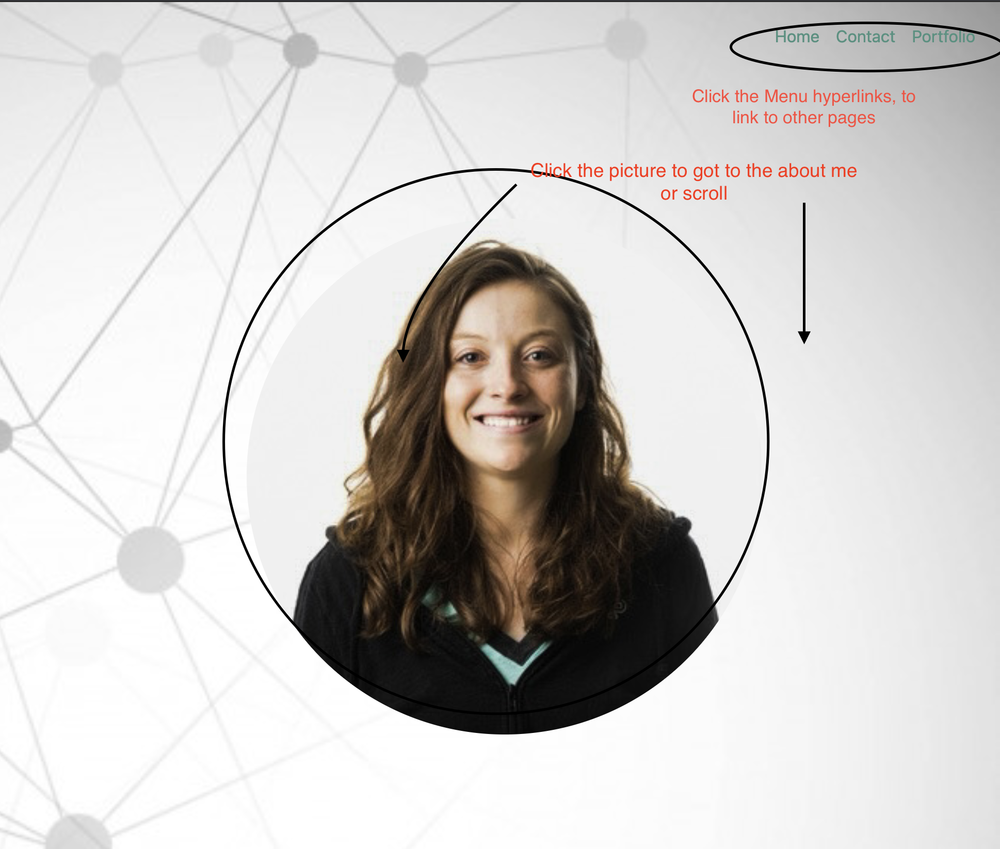
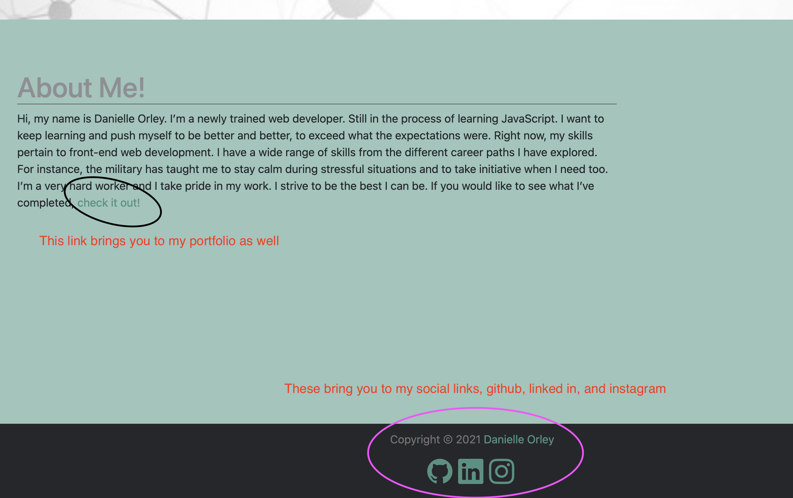
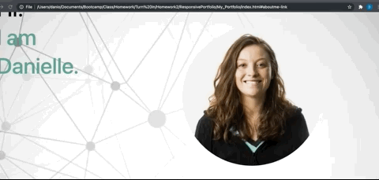

# My Portfolio

## Description 
---
This is my portfolio. I wanted to create a portfolio to showcase some of my new skill as a web developer. The first thing I did was research. What did I want it to look like? Looking through my guidelines and multiple other websites, I decided I knew what I wanted it to look like. I sketched out the basic outline and functions on a piece of paper. Then I got to work.

    1. I created the index.html, portfolio.html, and contact.html. Linking them together
    2. I did some research on bootstrap navbars and found one I liked. That is when I created the navbar.
    3. I put together the main page first. I used media queries(for a responsive layout), after setting my columns and rows. I chose to have a main area then when you scroll down it is a paragraph about me. 
    4. Designed the footer. Wanted my social links on them. I used bootstrap icons for this. Then linked them to my pages.
    5. Then I got my form to work. 

Creating my portfolio, I learned alot skills. I learned: how to create multiple different pages, working with a grid system on bootsrap, more about bootstrap, linking social links, using media queries making the website more responsive, and how to work with a form. The form took me the longest.

url: 
## Table of Contents
---
* [Usage](#usage) 
* [Credits](#credits)
* [License](#liscense)
## Built With
---
    HTML
    CSS
    Small amount of Javascript

I used twitter's bootstrap library. 

## Usage
---
Opening my website, you will be at my main page that contains my picure, name, and an aboutme paragraph. You can click on the menu at the top to access the other parts of my website: contact and portfolio: 

To get to the about me area on the main page, you can either scroll or click the picture. Hovering on the Hi, I am, Danielle gets you different colors. 

In the about me paragraph, you will see my contact me is a hyperlink and can be clicked to link you to my contact as well. My footer has the social links that link you to my pages.

 

 

In all of my paragraphs you will find similar links to my different pages or you can use the menu bar to go to the different pages.
 

When you submit a form it will send you to a page that says successful.
You may proceed to go back. The form uses gform. 

 
If you would like to you can also see when you go to a smaller screen it is responsive. The menu does collapse and you are able to open it and click on the items. 
 

 

## Credits
---
    I followed the following tutorial for my form. It is a gform from github.

    url: https://github.com/dwyl/learn-to-send-email-via-google-script-html-no-server#send-email-from-a-static-html-form-using-google-apps-mail

## License
---
Copyright © 2021 Danielle Orley 
